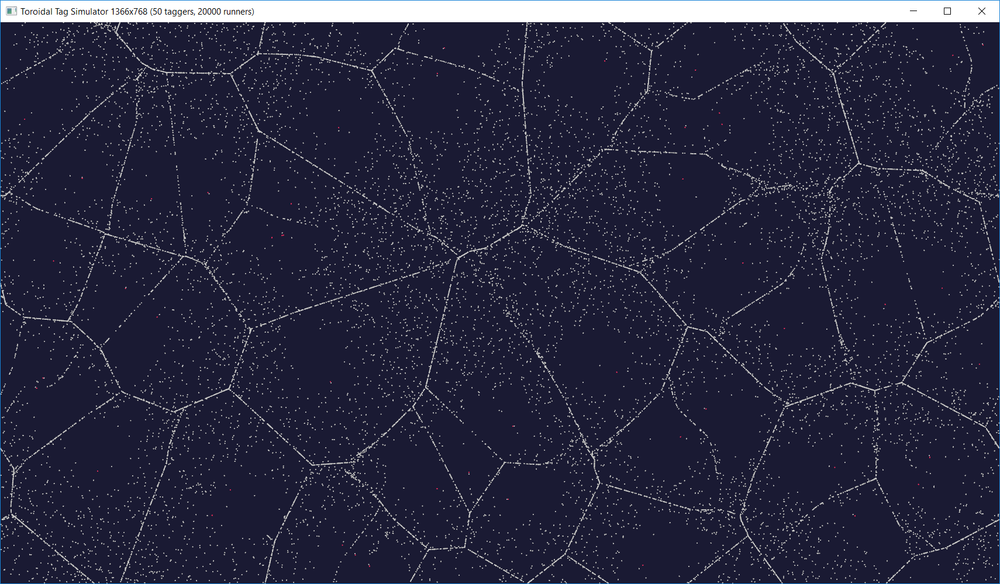

# You Are IT

An agent based simulation of the classic playground game It (AKA Tag), implemented in `Rust` using `Piston` for graphics.

## How to Run

1. Set the options at the top of `main.rs` to the values that you want to try (or use the defaults). They have the following meanings:

   - `WIDTH` - the width of the window (and game world) in pixels
   - `HEIGHT` - the width of the window (and game world) in pixels
   - `ITTERS` - the number of agents assigned as "it" at the start of the simulation
   - `RUNNERS` - the number of agents assigned as "not-it" at the start of the simulation
   - `SPEED` - the speed at which the agents move
   - `IT_RANGE` - the range in pixels within which an agent must get to "it" another

2. Run `cargo run` from the root of the repo

`TODO: move options to config file or command line argumements to avoid recompilation.`

## Agent Strategy

The game takes place in a toroidal space, that is, when an agent leaves one edge of the screen it re-enters at the opposite edge. This was chosen to prevent the agents from all coalescing in the corners when evading the "itters".

The current agent implementation, `SimpleAgent`, operates by a very simple strategy. If it is "it", it finds the nearest agent that is "not-it" and heads towards it. If it is "not-it", it finds the nearest agent that "it" and heads away from it. As "tag-backs" are not allowed, "itting" agents ignore the agent that itted them and "running" agents do not fear the agent that they most recently itted.

To ensure that "its" occur, agents that are "it" recieve a 10% speed boost over their "not-it" counterparts.

## Results

An immediately striking result with larger simulations is that the "running" agents quickly converge on a pattern approximating the Voronoi diagram of the "itting" agents. This makes sense as the runners flee directly away from the itters, meaning that they congregate at points equidistant between two itters.



Due to their speed advantage, the itting agents are always eventually able to catch a runner. This causes edges of the Voronoi pattern to be lost over time until just a few edges remain. As there is no incentive for the running agents to separate the pattern fades into boringness.


## Performance

`TODO: profile FPS against number of agents, consider attempting parallelism and/or using a tree data structure to hold the agent positions.`

## Implementation Difficulties

One of the challenges that I faced when learning Rust from my background in less memory-safe languages such as C++ is the many constraints on the availability of mutable references.

For example, in the update sequence, I wanted to achieve something like the following:

```
for agent in agents {
    agent.update(dt, &agents);
}
```

However, since update is both required to mutate the agent (e.g. to update its position) and hold a reference to all the other agents (to find its neighbours), the above pseudocode is not achievable in Rust. Instead, a deep copy must be passed as follows:

```
let mut last_agents = agents.clone();

for agent in &mut agents {
    agent.update(dt, &mut last_agents);
}
```

Because I have attempted to keep the `Agent` trait generic, implementing it with `SimpleAgent`, the size of a vector of `Agent` is not necessarily known at compile time. This meant that the vector in fact holds boxed references, making it tricky to implement the `Clone` trait.

Fortunately `Stack Overflow` came to the rescue and I was able to get a working implementation thanks to the following question and answer: https://stackoverflow.com/questions/50017987/cant-clone-vecboxtrait-because-trait-cannot-be-made-into-an-object.
