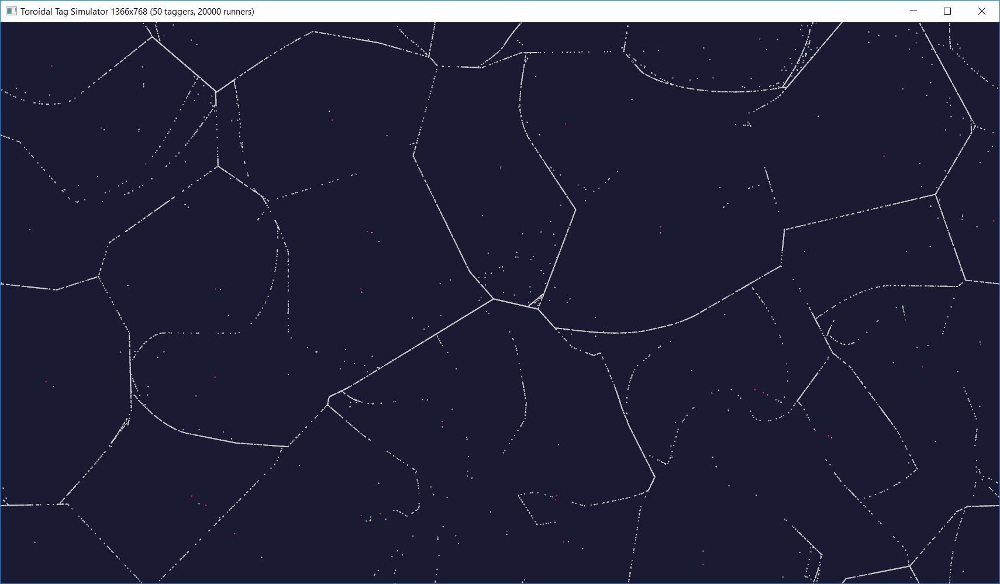

# Toroidal Tag Simulator

An agent based simulation of the classic playground game It (AKA Tag) as played by several thousand rational(-ish) agents on the surface of a torus. Implemented in `Rust` using `Piston` for graphics.

## How to Run

1. Set the options at the top of `main.rs` to the values that you want to try (or use the defaults). They have the following meanings:

   - `WIDTH` - the width of the window (and game world) in pixels
   - `HEIGHT` - the width of the window (and game world) in pixels
   - `ITTERS` - the number of agents assigned as "it" at the start of the simulation
   - `RUNNERS` - the number of agents assigned as "not-it" at the start of the simulation
   - `SPEED` - the speed at which the agents move
   - `IT_RANGE` - the range in pixels within which an agent must get to "it" another

2. Run `cargo run` from the root of the repo

`TODO: move options to config file or command line arguments to avoid recompilation.`

## Agent Strategy

The game takes place in a toroidal space, that is, when an agent leaves one edge of the screen it re-enters at the opposite edge. This was chosen to prevent the agents from all coalescing in the corners when evading the "itters".

An agent in the simulation must implement the `Agent` trait. The current agent implementation, `SimpleAgent`, operates by a very simple strategy. If it is "it", it finds the nearest agent that is "not-it" and heads towards it. If it is "not-it", it finds the nearest agent that "it" and heads away from it. As "tag-backs" are not allowed, "itting" agents ignore the agent that itted them and "running" agents do not fear the agent that they most recently itted.

To ensure that "its" occur somewhat frequently, agents that are "it" recieve a 10% speed boost over their "not-it" counterparts.

## Results

An immediately striking result with larger simulations is that the "running" agents quickly converge on a pattern approximating the Voronoi diagram of the "itting" agents. This makes sense as the runners each flee directly away from their closest itter, meaning that they congregate at points equidistant between two itters.


Due to their speed advantage, the itting agents are always eventually able to catch a runner. This causes edges of the Voronoi pattern to be lost over time until just a few edges remain. As there is no incentive for the running agents to separate the pattern fades into boringness:



## Performance

Since the agents all only consider the position of their neighbours at the previous timestep, they can all be updated entirely independently. This makes this process highly parallisable. I decided to take advantage of this by using `Rayon` to replace the `agents.iter_mut().for_each(...)` with its parallel implementation `agents.par_iter_mut().for_each(...)`. This made virtually no difference at 400 runners, but for 25,600 achieved a speedup of more than 2x.

| Itters | Runners | Parallel? | Updates/s | %chg  | Frames/s | %chg  |
| ------ | ------- | --------- | --------- | ----- | -------- | ----- |
| 50     | 200     | N         | 119.12    | -     | 57.72    | -     |
| 50     | 400     | N         | 118.81    | -     | 57.62    | -     |
| 50     | 800     | N         | 102.05    | -     | 48.57    | -     |
| 50     | 1600    | N         | 27.49     | -     | 27.50    | -     |
| 50     | 3200    | N         | 10.64     | -     | 10.65    | -     |
| 50     | 6400    | N         | 3.55      | -     | 3.56     | -     |
| 50     | 12800   | N         | 1.08      | -     | 1.10     | -     |
| 50     | 25600   | N         | 0.30      | -     | 0.32     | -     |
| 50     | 200     | Y         | 119.02    | -0.1  | 57.70    | 0.0   |
| 50     | 400     | Y         | 118.55    | -0.2  | 57.53    | -0.2  |
| 50     | 800     | Y         | 108.64    | 6.5   | 56.71    | 16.8  |
| 50     | 1600    | Y         | 32.45     | 18.0  | 32.46    | 18.0  |
| 50     | 3200    | Y         | 15.12     | 42.1  | 15.11    | 41.9  |
| 50     | 6400    | Y         | 6.25      | 76.1  | 6.25     | 75.6  |
| 50     | 12800   | Y         | 2.12      | 96.3  | 2.13     | 93.6  |
| 50     | 25600   | Y         | 0.67      | 123.3 | 0.68     | 112.5 |

This table shows both the average milliseconds _between_ agent update ticks and _between_ each frame, not the time taken by these operations. This is because the updates and renders are not (currently) performed concurrently. These times were recorded using my `FPSCounter` implementation and the average over the first 60 seconds is recorded here. The same data is plotted on a log-log plot below:


In an attempt to improve performance further, I implemented a kd-tree (see `agent_tree.rs`). This is constructed once per agent per frame, and allows the finding of neighbours in `O(log n)` worst case time complexity as opposed to the `O(n)` acheived by linearly searching a vector. It is used by substituting the following code into the update case:

```rust
let agent_tree = AgentTree::new(&agents);

agents.par_iter_mut().for_each(|agent| {
    agent.update(
        args.dt,
        &agent_tree.get_in_euclidean_range(agent.get_position(), 100.),
        agent::Options {
            bounds: vec::Vec2 {
                x: WIDTH as f64,
                y: HEIGHT as f64,
            },
            it_range: IT_RANGE,
            speed: SPEED,
        },
    );
});
```

Despite the substantial theoretical reduction in worse case time complexity, this implementation does not have good performance at all. In the 20,000 agent case, it takes upwards of 60,000ms / Frame, that is, less than one frame per minute.

I suspect this may be due to one or more of the following:

- The use of boxed traits rather than fixed size objects results in enourmous amounts of heap allocation and dynamic dispatch
- Under the hood, Rust/Rayon may well be adding locks to the data structure to maintain consistency, and may be facing high contention
- My implementation may contain a bug

Furthermore, this implementation does not (yet) account for the wrapping of the space around the edges, meaning that its results may vary from that with the simple vector implementation.

## Implementation Difficulties

One of the challenges that I faced when learning Rust from my background in less memory-safe languages such as C++ is the many constraints on the availability of mutable references.

For example, in the update sequence, I wanted to achieve something like the following:

```rust
for agent in agents {
    agent.update(dt, &agents, ...);
}
```

However, since update is both required to mutate the agent (e.g. to update its position) and hold a reference to all the other agents (to find its neighbours), the above pseudocode is not achievable in Rust. Instead, a deep copy must be passed as follows:

```rust
let mut last_agents = agents.clone();

for agent in &mut agents {
    agent.update(dt, &mut last_agents, ...);
}
```

Because I have attempted to keep the `Agent` trait generic, implementing it with `SimpleAgent`, the size of a vector of `Agent` is not necessarily known at compile time. This meant that the vector in fact holds boxed references, making it tricky to implement the `Clone` trait.

Fortunately, `Stack Overflow` came to the rescue and I was able to get a working implementation thanks to the following question and answer: https://stackoverflow.com/questions/50017987/cant-clone-vecboxtrait-because-trait-cannot-be-made-into-an-object.

Finally, I wanted to try using `Rayon` to perform the agent updates in parallel. `Rayon` provides parallel implementations of the existing sequential iterators, so to be able to use it I had to again refactor this for loop into a more functional style for-each:

```rust
agents.iter_mut().for_each(|agent| {
    agent.update(
        args.dt,
        &last_agents,
        ...
    );
});
```

## Future Improvements

There is far more to this project than could possibly be explored in a single weekend. Some of the ideas I have for further development are:

- Move options to config file or command line argumements to avoid recompilation for each change in setup
- Further explore the space of agent behaviours - vision, memory, neural networks etc.
- Make the environment more interesting, e.g. by adding obstacles or powerups
- Implement unit tests to validate e.g. the `AgentTree` implementation
- Create a 3D visualisation with camera controls, perhaps even let the user play
- Improve the parallelisation e.g. by using the GPU to unlock further performance and scale
- Allow scripting of agent behaviours using an interpreted language such as Python
